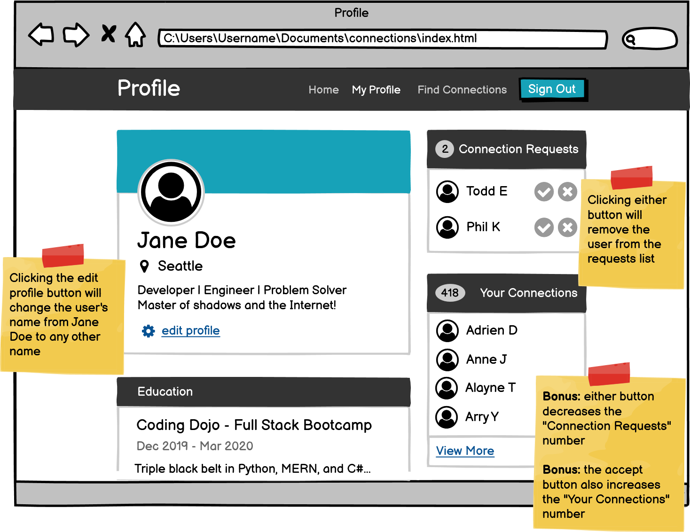

# Making Connections
This was an exercise I completed for Coding Dojo's Web Fundamentals stack.
### Objectives:
* Revisit a previous project and implement JavaScript functionality.
* Clicking the edit profile button changes the username to any name.
* Clicking either the decline or accept buttons in the friend request field will remove the corresponding user from the list.
* Clicking the accept button will add to the total number of friends.
### Additional functionality for extra practice:
* If there are 0 friend requests, the entire friend request box will be removed.
## I was given this wireframe as a reference:

